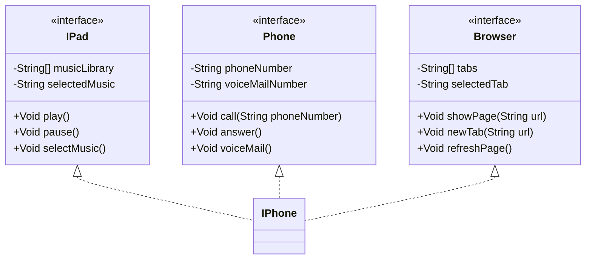

# dio-poo

## Classes Diagram

```mermaid
classDiagram
  class IPad {
    <<interface>>
    -String[] musicLibrary
    -String selectedMusic
    +Void play()
    +Void pause()
    +Void selectMusic()
  }

  class Phone {
    <<interface>>
    -String phoneNumber
    -String voiceMailNumber
    +Void call(String phoneNumber)
    +Void answer()
    +Void voiceMail()
  }

  class Browser {
    <<interface>>
    -String[] tabs
    -String selectedTab
    +Void showPage(String url)
    +Void newTab(String url)
    +Void refreshPage()
  }

  class IPhone {
  }

  IPad <|.. IPhone
  Phone <|.. IPhone
  Browser <|.. IPhone
```
